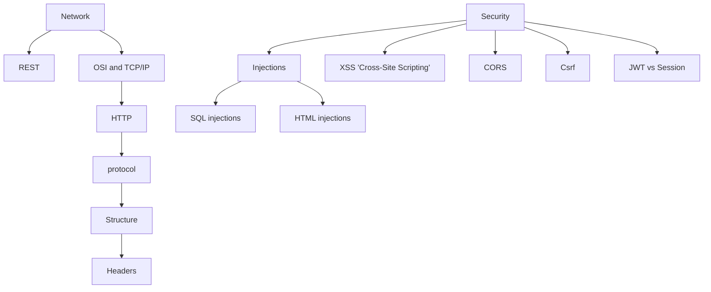

# Network and Security

```mermaid
graph TD
;
    network[Network];
%%%%        
    network --> rest[REST];
    network --> osi_and_tcp_ip[OSI and TCP/IP];
    osi_and_tcp_ip --> http[HTTP];
    http --> protocol[protocol];
    protocol --> structure[Structure];
    structure --> headers[Headers];
%%%%    
    security[Security];
    security --> injections[Injections]
    security --> XSS[XSS 'Cross-Site Scripting']
    security --> cors[CORS]
    security --> csrf[Csrf]
    security --> JWT_vs_Session[JWT vs Session]
%%%%        
    injections --> sql_injections[SQL injections]
    injections --> html_injections[HTML injections]
```

# Priority

1. Все последовательно
2. ...
